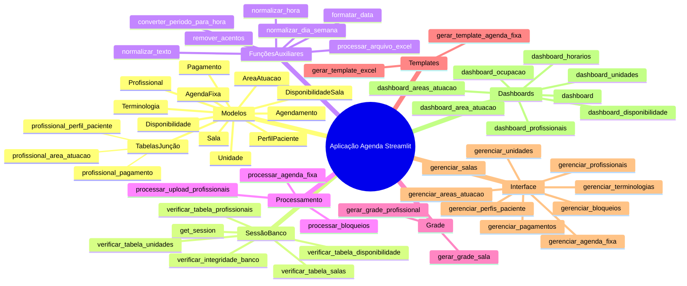

# Documentação da Aplicação Agenda Streamlit

## 1. Introdução
Este documento apresenta uma visão geral da aplicação de gerenciamento de agenda estática desenvolvida em Python com Streamlit e SQLAlchemy. A solução permite cadastrar profissionais, unidades, salas, áreas de atuação, tipos de pagamento, perfis de paciente, gerar grades de disponibilidade e realizar upload de agendas fixas.

## 2. Estrutura do Projeto
- Arquivo principal: `app.py`
- Linguagem: Python 3.x
- Principais bibliotecas:
  - Streamlit (interface web)
  - Pandas (manipulação de dados)
  - SQLAlchemy (ORM e modelagem de banco)
  - Datetime, Logging, Traceback (auxiliares)

## 3. Modelos (SQLAlchemy)
### 3.1 Tabelas de Junção
- `profissional_area_atuacao`: relaciona profissionais ↔ áreas de atuação
- `profissional_pagamento`: relaciona profissionais ↔ tipos de pagamento
- `profissional_perfil_paciente`: relaciona profissionais ↔ perfis de paciente

### 3.2 Classes Principais
- **Unidade**: armazena informações de cada unidade física
- **Sala**: salas dentro de cada unidade
- **AreaAtuacao**: áreas de atuação dos profissionais
- **Pagamento**: tipos de pagamento aceitos
- **PerfilPaciente**: perfis de paciente atendidos
- **Disponibilidade**: disponibilidade de horários de profissionais
- **DisponibilidadeSala**: disponibilidade de salas
- **Terminologia**: termos de faturamento vinculados a áreas e pagamentos
- **Profissional**: cadastra profissionais e relaciona com áreas, pagamentos e perfis
- **AgendaFixa**: armazenamento de agendas fixas via upload
- **Agendamento**: agendamentos realizados em tempos reais

## 4. Sessão e Banco de Dados
- `get_session()`: retorna sessão de conexão ao banco
- `verificar_integridade_banco()`: checa e inicializa tabelas
- `verificar_tabela_unidades()`, `verificar_tabela_salas()`, etc.: garantem existência de cada tabela

## 5. Funções Auxiliares
- `remover_acentos(texto)`
- `normalizar_texto(texto)`
- `normalizar_dia_semana(dia)`
- `normalizar_hora(valor)`
- `converter_periodo_para_hora(periodo)`
- `formatar_data(data_valor)`
- `converter_para_inteiro(valor)`
- `converter_para_texto(valor)`
- `salvar_arquivo_temporario(uploaded_file)`
- `processar_arquivo_excel(arquivo)`
- `mapear_dia_semana(data)`, `obter_dia_semana(data)`

## 6. Processamento de Upload
- `processar_upload_profissionais(session, df)`: importa/atualiza profissionais e atribui áreas, pagamentos e perfis
- `processar_agenda_fixa(df)`: trata linhas de agenda fixa e atualiza status de disponibilidade
- `processar_bloqueios(df)`: processa bloqueios de agendas

## 7. Geração de Grade
- `gerar_grade_profissional(session, profissional_id)`: cria slots semanais para cada profissional
- `gerar_grade_sala(session, sala_id)`: cria slots semanais para cada sala

## 8. Templates
- `gerar_template_excel(nome_arquivo, colunas)`: cria arquivo Excel com colunas especificadas
- `gerar_template_agenda_fixa(nome_arquivo)`: template específico para agenda fixa

## 9. Componentes de Interface (Streamlit)
- **Gerenciamento**:
  - `gerenciar_profissionais()`
  - `gerenciar_areas_atuacao()`
  - `gerenciar_pagamentos()`
  - `gerenciar_perfis_paciente()`
  - `gerenciar_unidades()`
  - `gerenciar_salas()`
  - `gerenciar_terminologias()`
  - `gerenciar_bloqueios()`
  - `gerenciar_agenda_fixa()`
- **Dashboards**:
  - `dashboard()`
  - `dashboard_unidades()`
  - `dashboard_areas_atuacao()`
  - `dashboard_disponibilidade()`
  - `dashboard_profissionais()`
  - `dashboard_ocupacao()`
  - `dashboard_area_atuacao()`
  - `dashboard_horarios()`

## 10. Execução
O ponto de entrada é a função `main()`, invocada ao rodar `app.py` diretamente.

---

## Mapa Mental da Aplicação
